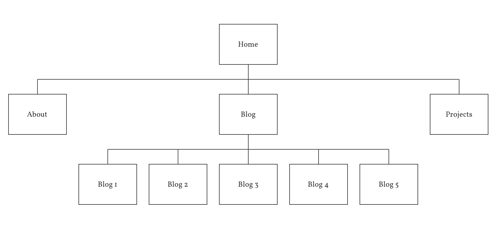
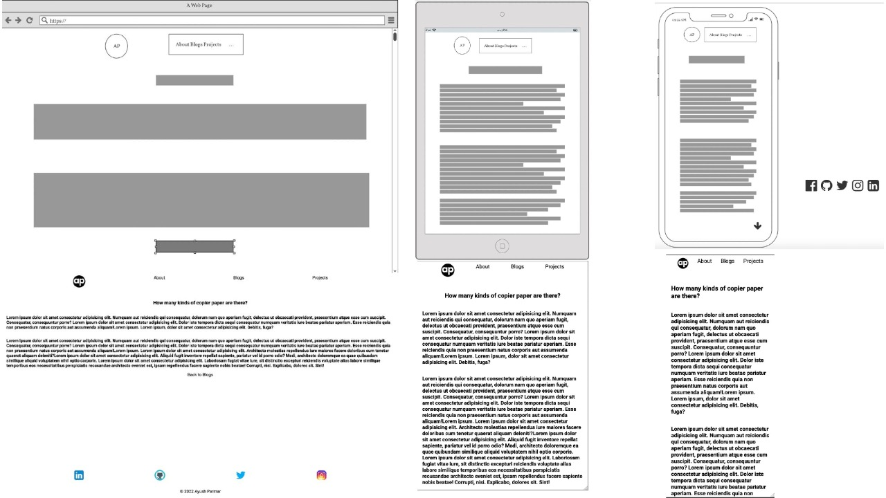
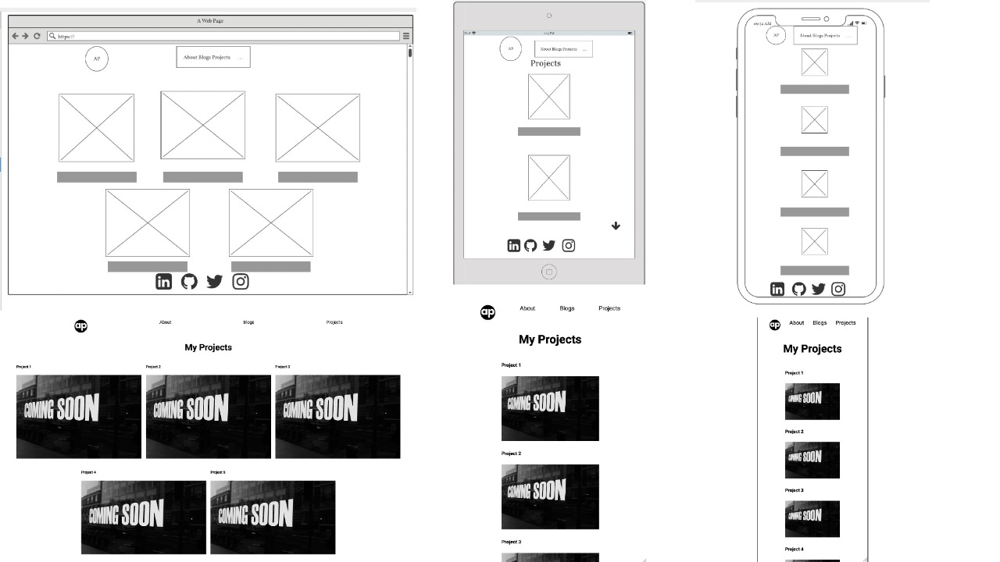

# Portfolio Documentation

## [portfolio website](https://github.com/Ayushc0d3s/AYUSHPARMAR_T1A2)

## [Github repository] ()

## [presentation] ()

## Purpose and Target audience

The purpose of this project is to demonstrate to recruiters my learning start point and journey as I progress through my full stack development course.

## Features and Functionality

- Homepage showcasing my name,portait contact information and links to my github and social media accounts.
- About page containing information about my journey and how I discovered my underlying interest for the IT world and at last, My hobbies.
- Blog page that contains links to five different blog pages.
- Project page that will showcase my knowledge and skills as I will link my future projects in it.

## Tech stack

- Visual Studio code was used to write all HTMl and css code.
- GITHUB for publishing repository.
- Firefox for testing purposes.
- Adobe illustrator for editing images.
- GITHUB pages for deployment.

## Sitemap

Created via Balsamic wireframes

## wireframe and website screenshots

Home page

About me

Blogs

Blog page layout

Projects page

## Final notes

Thank you for checking out my portfolio
